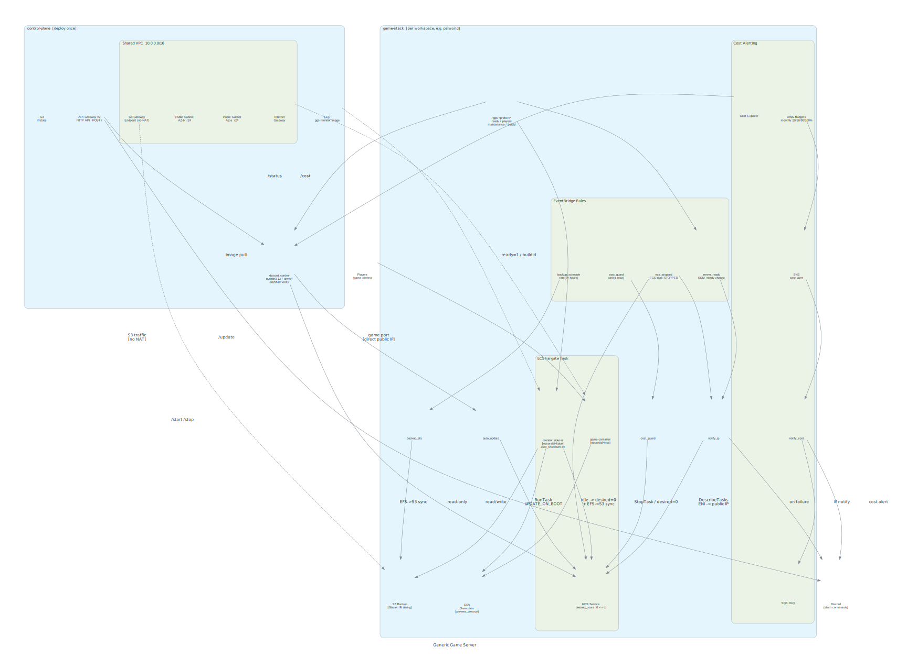

# CLAUDE.md

このファイルは、リポジトリのコードを操作する際に Claude Code (claude.ai/code) へ提供するガイダンスです。

## プロジェクト概要

オンデマンドのゲームサーバー（Palworld、Minecraft など）をほぼゼロのアイドルコストで運用するための AWS インフラ。制御は Discord スラッシュコマンドのみで行う。Makefile もテストスイートも存在しない — 純粋な Terraform + Python + Bash プロジェクト。

## 構成図



再生成: `docs/architecture/.venv/bin/python docs/architecture/diagram.py`（セットアップ詳細: [docs/architecture/README.md](docs/architecture/README.md)）

## スタック

- **IaC:** Terraform 1.5.6+（`.terraform-version` で強制）
- **コンピューティング:** AWS ECS Fargate（パブリックサブネット、固定コスト削減のため NAT なし）
- **ストレージ:** AWS EFS（永続セーブデータ）+ S3（バックアップ、tfstate）
- **コントロールプレーン:** Discord スラッシュコマンド → API Gateway v2 HTTP API → Lambda
- **Lambda ランタイム:** Python 3.12；外部依存なし（ed25519 検証は純粋な Python 実装）

## 2 スタック構成

### `control-plane/` — AWS アカウントに 1 度だけデプロイ

Discord ボットと**全ゲームで共有する VPC** をホスト。単一の Lambda がすべてのスラッシュコマンド（`/games`、`/start`、`/stop`、`/status`、`/cost`、`/update`）を処理し、ECS/SSM/Cost Explorer API を直接呼び出す。

```
Discord POST → API Gateway v2 HTTP API → Lambda (index.py)
  ├─ ed25519.py: リクエスト署名の検証
  ├─ provider.py: Discord 固有のレスポンスフォーマット
  └─ ECS/SSM/Cost Explorer へディスパッチ

共有ネットワーク（network.tf）:
  └─ aws_vpc "ggs-shared-vpc" + 2 パブリックサブネット + IGW + S3 VPC Endpoint
     ↑ game-stack はタグ "ggs-shared-vpc" / "ggs-shared=true" でこれを参照する
```

注: Lambda Function URL はアカウントレベルのパブリックアクセス設定によりブロックされるため使用しない。代わりに API Gateway v2 を使用（同様のゼロ固定コストモデル）。

**デプロイ順序**: control-plane を先に apply して共有 VPC を作成してから、game-stack を apply すること。

### `game-stack/` — ゲームごとに 1 つの Terraform ワークスペース

各ゲーム（`terraform workspace new palworld`）は独立した AWS リソースを持つ：ECS クラスター/サービス、EFS、S3 バックアップバケット、および複数の Lambda。**VPC は control-plane の共有 VPC をタグルックアップで参照する**（ゲームごとに作成しない）。ゲームごとのセキュリティグループ（SG）は個別に作成し、ネットワーク的な分離は維持する。

```
ECS タスク（コンテナ 2 つ）:
  ├─ ゲームコンテナ (essential=true) — 実際のゲームサーバー
  └─ モニターサイドカー (essential=false, auto_shutdown.sh):
       1. 依存パッケージをインストール (dnf)、SSM ready=0 で初期化
       2. フェーズ A: ゲームポートが準備完了になるまでポーリング → SSM に ready=1 + buildid を書き込み
       3. フェーズ B: プレイヤー数をポーリング → idle_timeout_minutes 間アイドルなら停止
       4. EFS を S3 へバックアップ、その後 ECS サービスを停止 (desired-count=0)

EventBridge ルール:
  ├─ SSM /ggs/<prefix>/ready が "1" に変化 → notify_ip Lambda → Discord（IP を送信）
  ├─ ECS タスク STOPPED → notify_ip Lambda → Discord（停止通知）
  └─ スケジュール → cost_guard Lambda（max_task_runtime_hours でハード停止）

コストアラート:
  AWS Budgets → SNS → notify_cost Lambda → Discord webhook（+ 失敗時の SQS DLQ）
```

すべてのリソース名は `${game_name}-${workspace}-` でプレフィックスされる（例：`palworld-palworld-cluster`）。

## ECS クラスタータグ（サービスディスカバリ）

コントロールプレーンの Lambda は ECS クラスタータグを検査してゲームを動的に検出する — ゲームを追加しても再デプロイ不要：

| タグ | 値 | 使用箇所 |
|-----|-------|---------|
| `Game` | ゲーム名（例：`palworld`）| `/games`、`/start`、`/stop`、`/status` のオートコンプリート |
| `StatusParamPrefix` | `/ggs/<name_prefix>` | `/status` がこのプレフィックスから SSM パラメータを読む |
| `AutoUpdateFunction` | `<name_prefix>-auto-update` | `/update` がこの名前で Lambda を呼び出す |

## SSM パラメータ名前空間

すべてのゲームステータスパラメータは `/ggs/<name_prefix>/` 以下に存在する（例：`/ggs/palworld-palworld/`）：

| パラメータ | 書き込み元 | 読み取り元 | 用途 |
|-----------|--------|--------|---------|
| `ready` | モニターサイドカー、`/start` で 0 にリセット | notify_ip、`/status` | ゲームが接続受け付け中か（0/1）|
| `players` | モニターサイドカー | `/status` | 現在のプレイヤー数 |
| `notified_task` | notify_ip Lambda | `/status` | 通知済みタスク ARN（重複排除）|
| `maintenance` | auto_update Lambda | `/start`、`/update` | アップデート中の起動ブロック（0/1）|
| `installed_buildid` | モニターサイドカー（appmanifest から）| auto_update Lambda | インストール済み Steam ビルド ID |
| `update_ready` | モニターサイドカー（アップデートタスクのみ）| auto_update Lambda | アップデートタスク完了シグナル |

## Lambda パッケージング

Lambda ZIP ファイルは `terraform apply` のたびに Terraform の `archive_file` データソースによってビルドされる。手動のパッケージング手順は不要。共有モジュール `game-stack/functions/_shared/notifier.py` は `archive_file` リソース内の個別の `source {}` ブロックとして各ゲームスタック Lambda（notify_ip、notify_cost、auto_update）にバンドルされる。

## デプロイコマンド

```bash
# === control-plane（1 度だけ）===
cd control-plane
terraform init -backend-config=backend.hcl
terraform apply -var="discord_public_key=<64文字の16進数>" -var="aws_region=ap-northeast-1"
# outputs.interactions_endpoint_url を Discord Developer Portal にコピー

# スラッシュコマンドを登録（apply 後に 1 度だけ）
export DISCORD_APP_ID="..."
export DISCORD_BOT_TOKEN="..."
bash scripts/register_commands.sh

# === game-stack（ゲームごと）===
cd game-stack
terraform init -backend-config=backend.hcl
terraform workspace new palworld          # または: terraform workspace select palworld
terraform apply -var-file=../games/palworld.tfvars

# ゲームスタックを削除（⚠ 必ず terraform workspace show で対象を確認してから実行）
# workspace はゲームごとに state が分離されており他ゲームには影響しない。
# 共有 VPC（control-plane 管理）は data source 参照のみで game-stack destroy では消えない。
terraform workspace select palworld
terraform destroy -var-file=../games/palworld.tfvars
terraform workspace select default && terraform workspace delete palworld
```

### ゲームの冬眠（EFS 課金ゼロ化） と 復元

#### 冬眠手順（長期間遊ばないゲームの課金をゼロにする）

```bash
# 1. S3 バックアップが最新であることを確認（直前に停止 → モニターが自動同期済みのはず）
aws s3 ls s3://<backup-bucket>/<name-prefix>/ --region ap-northeast-1

# 2. storage.tf の prevent_destroy ブロックを一時的にコメントアウト
#    （EFS の誤削除防止ガードを外す）
# game-stack/storage.tf の lifecycle { prevent_destroy = true } をコメントアウト

# 3. 対象 workspace を確認してから destroy
terraform workspace show  # 必ず確認！
terraform workspace select <game>
terraform destroy -var-file=../games/<game>.tfvars
# → EFS が削除され課金がゼロになる。データは S3 に残存（Glacier IR へ自動降格）。

# 4. storage.tf の prevent_destroy を元に戻す（コミット）
terraform workspace select default && terraform workspace delete <game>
```

#### 復元手順（冬眠からの再開 / EFS 再作成後のリストア）

S3 からの復元は同一手順で、冬眠からの復帰・ストレージクラス変更（one_zone ↔ regional）・障害復旧に使い回せる。

```bash
# 1. terraform apply で空の EFS を再作成
terraform workspace new <game>  # または select
terraform apply -var-file=../games/<game>.tfvars

# 2. 一時的な復元タスクで S3 → 新 EFS に同期
#    既存の backup_efs Lambda の逆処理として手動 aws s3 sync を使う方法:
#    a) ECS Exec や一時タスクで EFS マウント済みのコンテナを起動
#    b) aws s3 sync s3://<backup-bucket>/<prefix>/ <efs-mount-path>/ --region ap-northeast-1
#    例（一時的な復元タスク起動、EFS がマウントされているコンテナ内で実行）:
aws s3 sync s3://palworld-palworld-backup/palworld-palworld/ /palworld/ --region ap-northeast-1

# 3. 以降は通常どおり Discord /start でゲームサーバーを起動
```

## 手動サーバー操作（Discord が使えない場合）

```bash
# 起動
aws ecs update-service --cluster palworld-palworld-cluster \
  --service palworld-palworld-service --desired-count 1 --region ap-northeast-1

# 停止
aws ecs update-service --cluster palworld-palworld-cluster \
  --service palworld-palworld-service --desired-count 0 --region ap-northeast-1

# ゲームサーバー + モニターのログをストリーミング
aws logs tail /ecs/palworld-palworld --follow --region ap-northeast-1

# Lambda ログをストリーミング
aws logs tail /aws/lambda/game-server-discord-control --follow --region ap-northeast-1
aws logs tail /aws/lambda/palworld-palworld-notify-ip --follow --region ap-northeast-1
aws logs tail /aws/lambda/palworld-palworld-auto-update --follow --region ap-northeast-1

# SSM ステータスパラメータを読む
aws ssm get-parameters-by-path --path /ggs/palworld-palworld --region ap-northeast-1
```

## 新しいゲームの追加

1. `games/example.tfvars` を `games/<game>.tfvars` にコピーして必要な値を入力する。
2. ゲームタイプに応じて `monitor_method` を設定する：
   - `"tcp"` — TCP ゲーム（例：Minecraft Java）
   - `"a2s"` — A2S_INFO 対応の Steam ゲーム（汎用 Steam）
   - `"rest"` — Palworld（REST API `/v1/api/players` を使用）
3. コスト最適化オプションを決める（コメントアウト済みの設定、後から変更困難なものもある）：
   - **CPU アーキテクチャ** — ゲームイメージが linux/arm64 を**ネイティブ提供**する場合のみ `task_cpu_architecture = "ARM64"` で約 20% 削減。x86 専用 Steam ゲームには設定しない（box64/FEX エミュレーションは効果相殺・不安定）。確認: `docker manifest inspect <image> | grep -A2 linux/arm64`
   - **EFS ストレージクラス** — 重要度が低いゲームには `efs_storage_class = "one_zone"` で約 45% 削減。**作成後の変更不可**（変更時は destroy → S3 復元が必要）。regional を選ぶと EFS Archive 自動階層化（90 日）も有効。
4. `terraform workspace new <game> && terraform apply -var-file=../games/<game>.tfvars`
5. コントロールプレーンは ECS クラスターの `Game` タグからゲームを自動検出する — コントロールプレーンの変更は不要。

## 主要設計判断

- **ALB/NAT なし:** Fargate に直接パブリック IP を割り当てることで固定コストを月約 $60 削減。セキュリティグループでインバウンドをゲームポートのみに制限。
- **API Gateway v2（Function URL ではなく）:** Lambda Function URL はアカウントレベルのパブリックアクセスブロックの無効化が必要で S3 に影響する。API Gateway v2 HTTP API は同じコストプロファイル（固定費なし）。
- **2 コンテナタスク:** モニターサイドカー（`essential=false`）はゲームコンテナを停止させずに自己終了でき、外部トリガーなしで ECS サービスを停止する。
- **ECS サービスはタスク定義の変更を無視:** `lifecycle { ignore_changes = [task_definition] }` により `terraform apply` でサービスが実行するタスク定義リビジョンは変更されない。代わりに `/start` は実行時に `ecs.describe_task_definition(family)` で最新の ACTIVE リビジョンを解決する。
- **純粋 Python ed25519:** Lambda レイヤーの複雑さを回避。`ed25519.py` は外部ライブラリなしで署名検証を実装。
- **共有 notifier モジュール:** `game-stack/functions/_shared/notifier.py` がメッセージング抽象化。`MESSAGING_PROVIDER=slack` を設定し Slack Incoming Webhook URL を `discord_webhook_url` として提供することで Slack に切り替え可能。スラッシュコマンドレスポンスの場合は `control-plane/functions/discord_control/` の `provider.py` も更新する。
- **コストガードの多層構造:** サイドカーのアイドル検知（ソフト）→ `cost_guard` Lambda のハード停止 → AWS Budgets アラート。3 つの独立した層でコストの暴走を防ぐ。
- **Palworld は ARM64 非対応（X86_64 のまま）:** Palworld 専用サーバーは SteamCMD 配布の x86_64 バイナリのみで ARM64 ネイティブビルドが存在しない。Graviton で動かすには box64/FEX エミュレーションが必要で、オーバーヘッドが約 20% 削減分を相殺し安定性も低下するため採用しない。ARM64 は `docker manifest inspect` でネイティブ arm64 対応が確認できるゲーム（Minecraft Java 等）にのみ設定する。
- **EFS ストレージクラスと階層化:** `efs_storage_class = "regional"`（既定）は複数 AZ 冗長 + 30 日 IA 移行 + 90 日 Archive 移行の 3 段階で自動コスト逓減。`"one_zone"` は単一 AZ で約 45% 安だが Archive 非対応で IA 止まり、かつ作成後変更不可。長期間プレイしないゲームは terraform destroy で EFS 課金をゼロにできる（S3 バックアップから復元可能）。
- **`/update` は update_service ではなく run_task を使用:** auto_update Lambda は `ecs.run_task` で `UPDATE_ON_BOOT=true` を設定した単発タスクを実行する。このタスクのモニターサイドカーは EventBridge 非対象の SSM パラメータ（`update_ready`）とダミーサービス名にリダイレクトされ、余分な IP 通知や誤ったサービス停止を防ぐ。

## 状態管理

両スタックとも S3 リモートバックエンドを使用。アカウント固有の設定は `backend.hcl` ファイルに記載（コミットしない）。`games/*.tfvars` ファイル（`example.tfvars` を除く）は `.gitignore` 済み — Webhook URL を含むアカウント固有の値が含まれるため。
